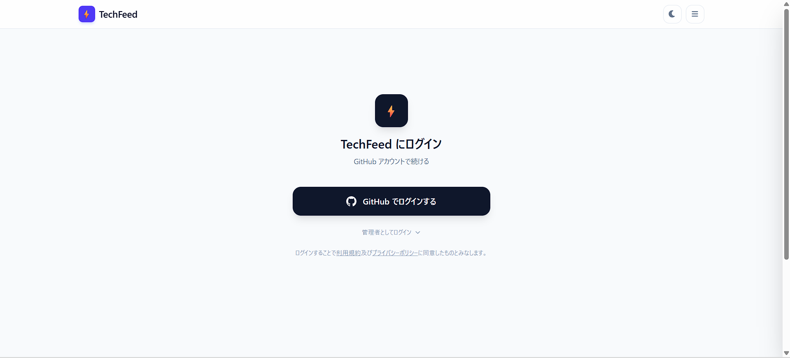
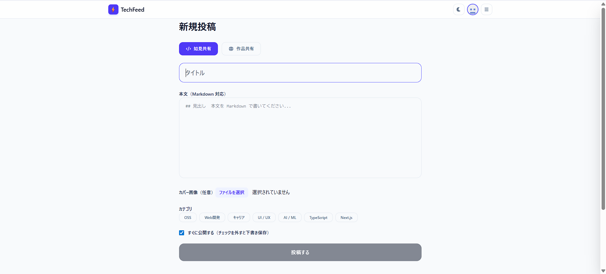
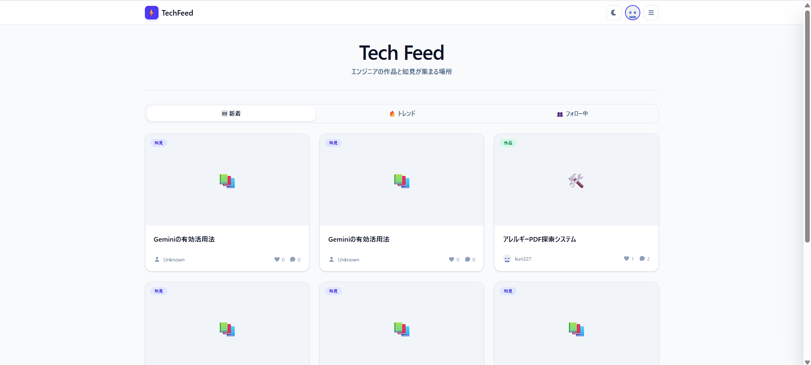
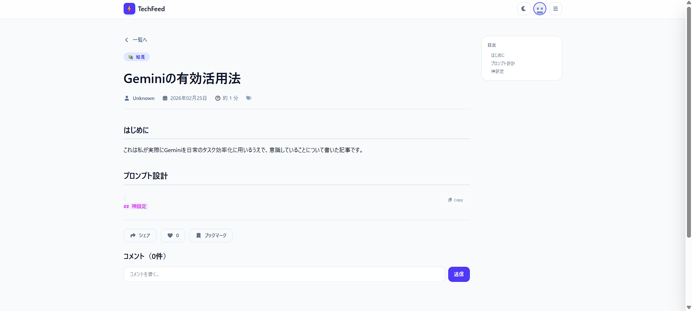
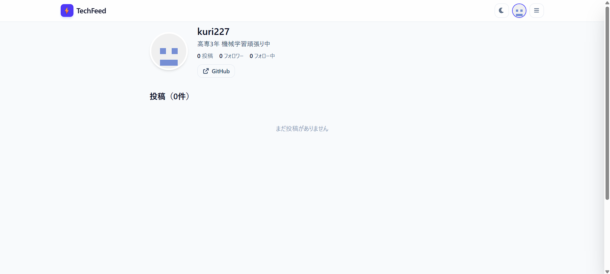
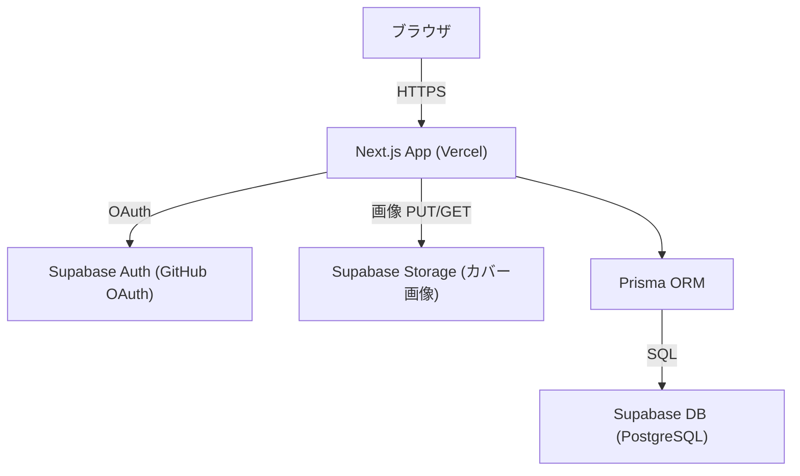

# TechFeed — エンジニアのための知識共有プラットフォーム

<!--  -->

## 概要

**TechFeed** は、エンジニア・学生・プログラミング学習者を対象とした技術知識共有プラットフォームです。
GitHub アカウントでログインし、自分の作品（PROJECT）や技術知見（KNOWLEDGE）を Markdown で投稿・共有することができます。
他ユーザーのフィードをタイトル・カテゴリで検索しながら閲覧でき、いいね・コメント・ブックマーク・フォローによってエンジニア同士がつながれます。

## 開発の背景・経緯

_私は、既存のブログアプリでは、自分が欲しかった技術的な情報が埋もれがちになってしまって、情報が入ってこないことが問題だと感じていました。
  そのため、技術的な情報をメインで収集できて、かつ既存のqiitaやzennといったwebサイトよりも、開発者個人個人が密接に関係できるブログアプリを作りたいと思いました。
  qiitaやzennには、有用な情報がたくさん掲載されていますが、そこからエンジニア同士のつながりや、フォロー関係になったりすることはあまりありません。それが個人的にはもったいないと感じていました。
  そこで、GitHubアカウントのみでログインできるブログアプリを作成することで、技術者同士が密接に関係できるブログアプリを作りたいと思いました。_

## 公開 URL

https://next-blog-app-drab.vercel.app/

---

## 特徴と機能の説明

### 1. GitHub OAuth ログイン & オンボーディング

Supabase Auth を利用した GitHub ソーシャルログインを実装しています。
初回ログイン後はオンボーディング画面でプロフィール（名前・自己紹介・スキル・興味分野・GitHub URL）を設定してからサービスを利用できます。

<!-- スクリーンショット: ログイン画面 -->
<!--  -->

### 2. Markdown 対応の投稿エディタ

リッチな Markdown 記事を作成・編集できます。
- **投稿タイプ**: 作品紹介（PROJECT）・知見共有（KNOWLEDGE）の 2 種類
- **カバー画像アップロード**: Supabase Storage にアップロード
- **リポジトリ URL / デモ URL**: PROJECT 投稿では外部リンクも添付可能
- **カテゴリ付け**: 複数カテゴリで記事を整理
- **Mermaid 対応**: コードブロックで図・チャートのレンダリングが可能
- **OGP カード**: URL を貼るとリンクカードを自動生成

<!-- スクリーンショット: 記事作成画面 -->
<!--  -->

### 3. フィード & 検索

ホームにタイル型カードを表示し、タイトルまたはカテゴリ名でリアルタイム検索できます。
各カードにはカバー画像・投稿タイプバッジ・著者アイコン・いいね数・コメント数を表示します。

<!-- スクリーンショット: フィード画面 -->
<!--  -->

### 4. いいね・コメント・ブックマーク・フォロー

ログイン中のユーザーは記事に対して以下のアクションが可能です。
- ❤️ **いいね** — 気に入った記事をワンタップで保存
- 💬 **コメント** — 記事への意見・感想を投稿
- 🔖 **ブックマーク** — 後で読みたい記事を保存
- 👥 **フォロー** — 気になる投稿者をフォロー

<!-- スクリーンショット: 記事詳細 -->
<!--  -->

### 5. プロフィール & 管理画面

- プロフィールページでスキルタグ・投稿一覧・フォロー/フォロワー数を確認できます。
- 管理画面（`/admin`）では自分の投稿の一覧・編集・削除が可能です。

<!-- スクリーンショット: プロフィール画面 -->
<!--  -->

---

## 使用技術（技術スタック）

### 言語・フレームワーク・ライブラリ

| カテゴリ | 技術 |
|---|---|
| 言語 | TypeScript |
| フレームワーク | Next.js 15 (App Router, Turbopack) |
| UI | React 19, Tailwind CSS v4 |
| ORM | Prisma 7 (PostgreSQL) |
| 認証 | Supabase Auth (GitHub OAuth) |
| Markdown | react-markdown, remark-gfm, rehype-highlight, rehype-slug |
| ダイアグラム | Mermaid.js |
| フォーム | <!-- React Hook Form を使用している場合は記入 --> |
| バリデーション | <!-- Zod を使用している場合は記入 --> |
| データフェッチ | <!-- SWR を使用している場合は記入 --> |
| 日付処理 | Day.js |
| アイコン | Font Awesome |
| その他 | isomorphic-dompurify, open-graph-scraper, crypto-js |

### 開発ツール・サービス

| ツール / サービス | 用途 |
|---|---|
| VSCode | エディタ |
| Supabase | DB (PostgreSQL), Auth, Storage |
| Vercel | ホスティング・デプロイ |
| Prisma Studio | DB GUI |
| ESLint / Prettier | コード品質 |

### システム構成図

---

## 開発期間・体制

- **開発体制**: 個人開発
- **開発期間**: 2026.01.15 ~ 2026.02.24（約 20 時間）

---

## 工夫した点・苦労した点

<!-- 以下は例です。実際の経験を書いてください -->

- **Supabase Auth × Prisma の連携**: Supabase の `auth.users` とアプリ独自の `User` テーブルを同期させ、オンボーディング完了フラグを管理する設計に工夫した。
- **App Router での認証フロー**: Next.js App Router においてサーバー・クライアント双方で認証状態を正しく扱うための実装に苦労した。
- **Mermaid.js の SSR 対応**: サーバーサイドレンダリング環境で Mermaid を動かすための動的インポートと回避策を実装した。

## 既知の課題と今後の展望

- ページネーション / 無限スクロールの実装
- 通知機能（いいね・コメント・フォロー）
- タグ・カテゴリフィルタリングの強化
- 全文検索（Supabase の `pg_trgm` / `tsvector` 活用）
- ダークモード対応の完成

---

## 連絡先

- ポートフォリオ: https://kuri227.github.io/My-Portfolio/
- GitHub: https://github.com/kuri227
- 所属: 高専
